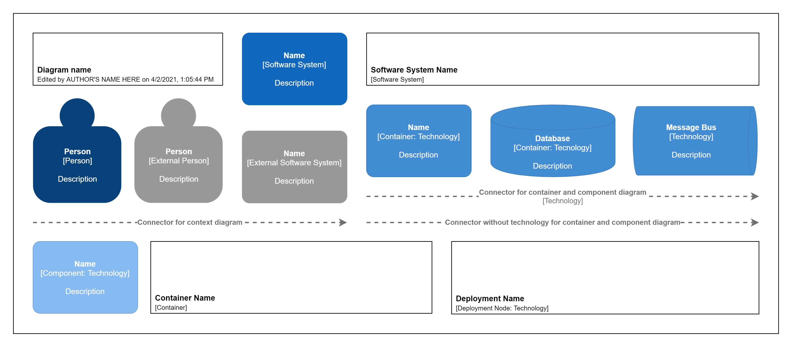
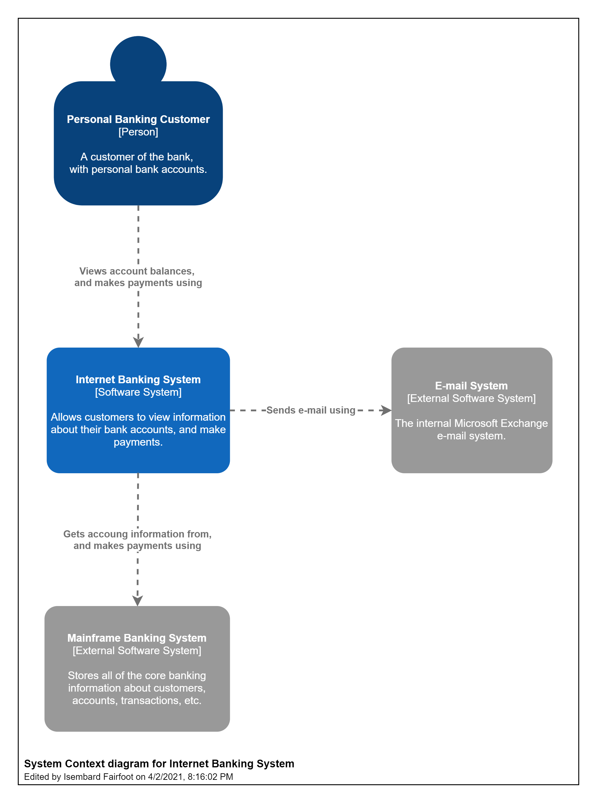
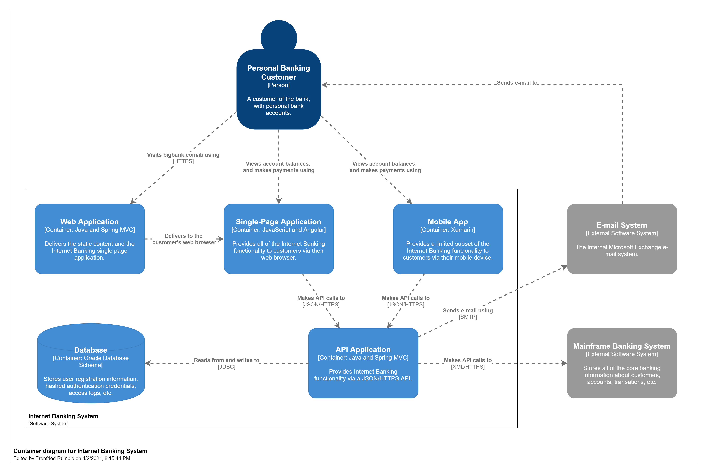
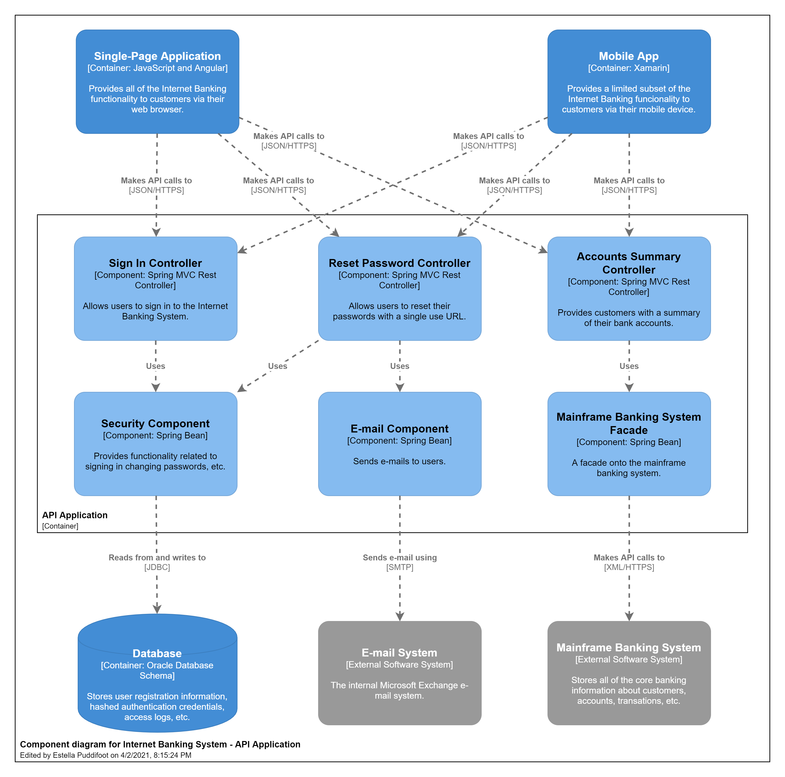
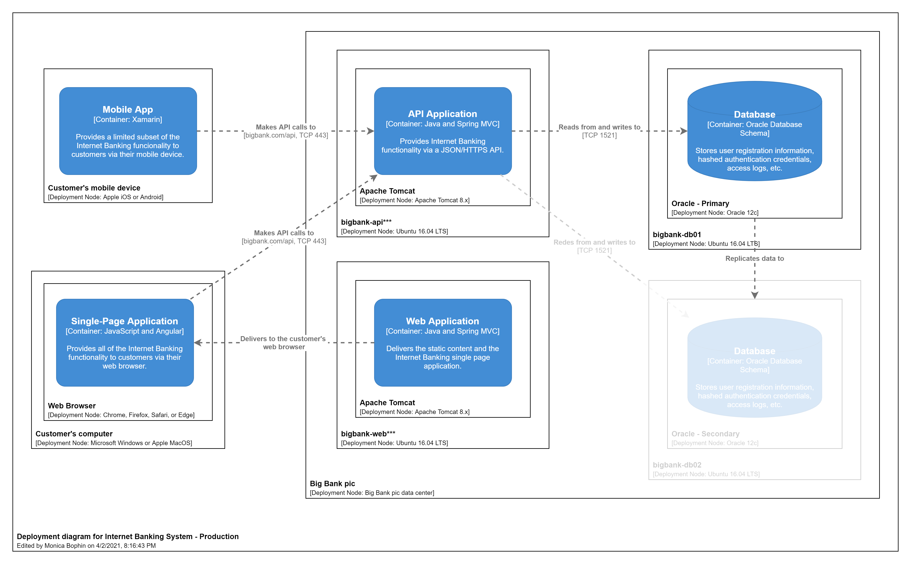

# Documentation

## About C4 Model

The C4 model was created as a way to help software development teams describe and communicate software architecture, both during up-front design sessions and when retrospectively documenting an existing codebase. It's a way to create maps of your code, at various levels of detail, in the same way you would use something like Google Maps to zoom in and out of an area you are interested in.

The C4 Model was idealized by Simon Brown and its documentation is available at [c4model.com](https://c4model.com/).

## About this project

The elements of this project were developed for the diagramming software [draw.io](https://www.diagrams.net/about.html) and are based on the C4 Model for visualizing software architecture.

## How to use the elements

1. Download the latest release of this project.
2. Open [draw.io](https://app.diagrams.net/) in your browser or the app installed on your desktop.
3. With the app open, click File, and then click Open Library.
4. Go to the folder where you saved the release and select the file Library C4 Model.xml and you are done!

## Available Elements

All available elements in the [latest release](https://github.com/brunohprada/c4-model-for-draw.io/releases/latest).

## Context Diagram Example

Example context diagram taken from [c4model.com](https://c4model.com/img/bigbankplc-SystemContext.png) produced with the elements of this project.

## Container Diagram Example

Example container diagram taken from [c4model.com](https://c4model.com/img/bigbankplc-Containers.png) produced with the elements of this project.

## Component Diagram Example

Example component diagram taken from [c4model.com](https://c4model.com/img/bigbankplc-Components.png) produced with the elements of this project.

## Deployment Diagram Example

Example deployment diagram taken from [c4model.com](https://c4model.com/img/bigbankplc-LiveDeployment.png) produced with the elements of this project.

## Landscape

Landscape of all diagrams and their positions just to inform. This image is not part of C4 Model.

### Credits and Funny Tools

- [Fantasy Name Generators](https://www.fantasynamegenerators.com/): Used to generate random names in example diagrams
- [DeepL](https://www.deepl.com/press.html): Used to generate English language documentation
